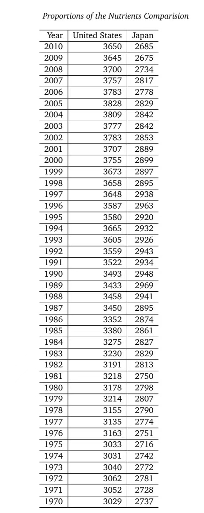
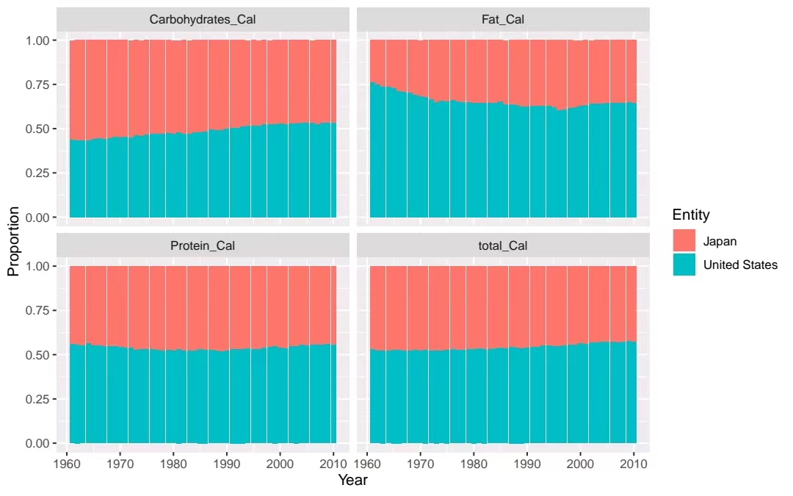
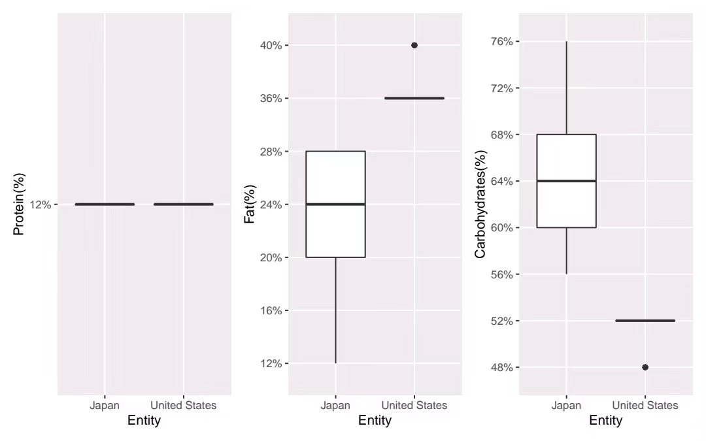
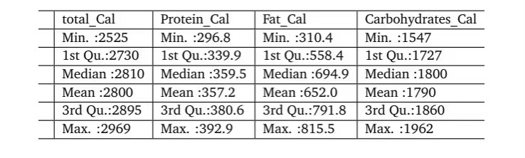
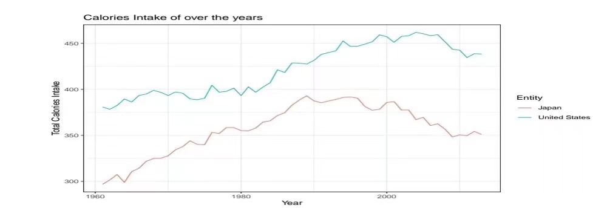
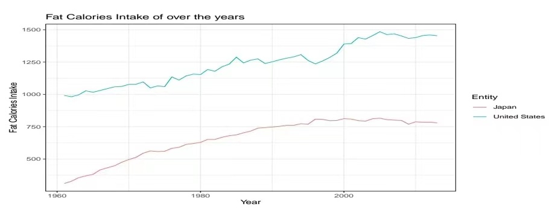

class: left, top

# Question

- .green[ (1)What is the difference in the proportions of total Calories and the three major nutrients (protein, fat, carbohydrate) from 1970 in the American and Japanese diets?]
- .green[ (2)  What is the difference between the time trends of TotalCalories and Calories of Protein, Fat, Carbohydrates in the two countries?]


---
- .bule[ Question1]
```{r out.width = '35%', echo = FALSE, fig.align="center"}

```


---
- .bule[ Proportion Share Across The Years]
```{r out.width = '65%', echo = FALSE, fig.align="center"}

```


- .bule[ Distribution of Protein,Fat,Carbohydrates]
```{r out.width = '65%', echo = FALSE, fig.align="center"}

```

---
#Question2
- .bule[ Calories Intake of United States]

```{r out.width = '90%', echo = FALSE, fig.align="center"}
knitr::include_graphics("figs/table2.jpg")
```


- .bule[ Calories Intake of Japan]

```{r out.width = '90%', echo = FALSE, fig.align="center"}

```

---
- .bule[ Calories Intake of over the years]

```{r out.width = '90%', echo = FALSE, fig.align="center"}

```


- .bule[ Fat Calories Intake of over the years]

```{r out.width = '90%', echo = FALSE, fig.align="center"}

```

