```{r setup, include=FALSE}
options(htmltools.dir.version = FALSE)
```


```{r , echo = FALSE, message = FALSE, warning = FALSE}
library(tidyverse)
library(palmerpenguins)
library(datasets)
```


class: center, middle
# Diet


---
class: center, middle


### Do you know how many calories an adult consumes in a day?

### Have you noticed a gradual increase in the number of people suffering from the disease?


---
class: left, top
# Analysis Process
.content-box-duke-Highland[ 
* Introduction
]

.content-box-duke-Highland[ 
* Research Questions
]

.content-box-duke-Highland[ 
* Analysis
]

.content-box-duke-Highland[ 
* Conclusion
]

---

class:  center, top

# Let's start!


---
class: left, top

# Introduction

```{r out.width = '70%', echo = FALSE, fig.align="center"}
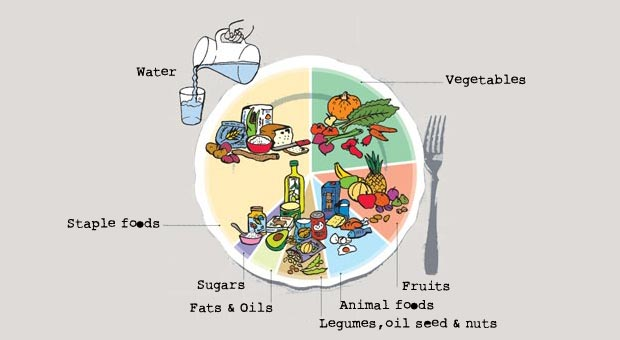
```

- Human is iron as if the meal is steel,you will be hungry if you don't eat.

- Cereals and grains, animal proteins, fats and other elements are essential for the maintenance of the body's vital characteristics.

- Unhealthy diet is the culprit of many diseases.


---
class: left, top

# Introduction
## Data Sources

```{r out.width = '90%', echo = FALSE, fig.align="center"}
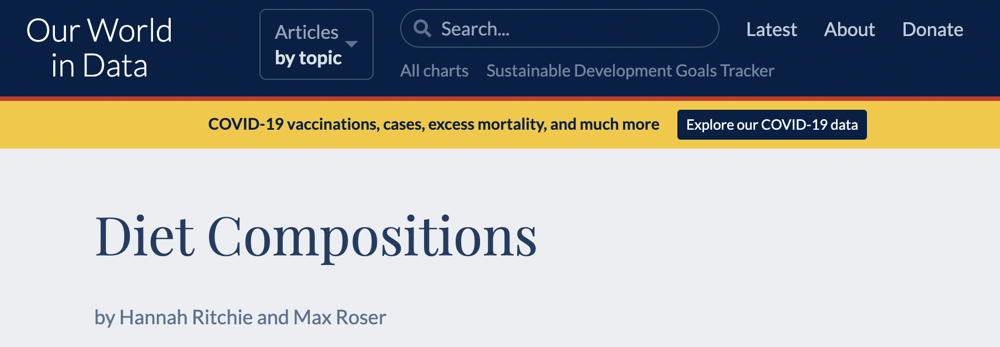
```


## https://ourworldindata.org/diet-compositions


---
class: left, top

# Analysis Part1


## Research Question1

- How the proportion of various food groups in the Australian diet changed over time?

```{r out.width = '75%', echo = FALSE, fig.align="center"}
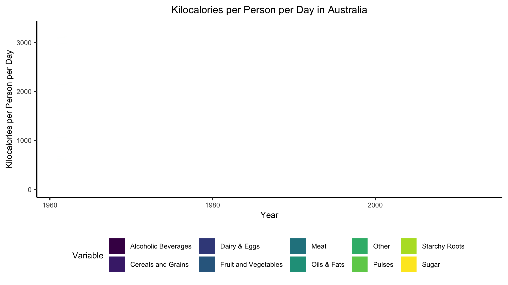
```

#### .darkgreen[More choices of cereals, meat, fats and sugary foods] 

---

class: left, top

## Research Question2

- How the intake of animal protein varies around the world?

```{r out.width = '75%', echo = FALSE, fig.align="center"}
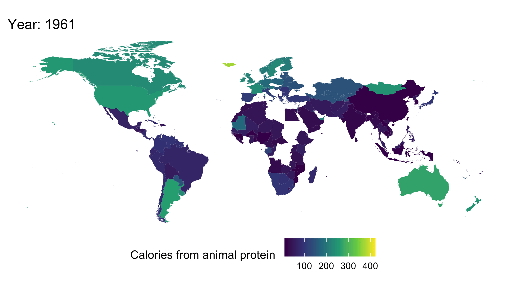
```

#### .darkgreen[North America, Oceania and Europe consume the most energy from animal protein] 
#### .darkgreen[Overall, energy is provided worldwide by consuming more animal protein]


---
class: left, top


## Research Question3

- In Australia, Brazil, China, South Africa, United Kingdom and United States, which country has the relatively best linear model of the relationship between overweight or obese and caloric supply since 2000?

```{r out.width = '86%', echo = FALSE, fig.align="center"}
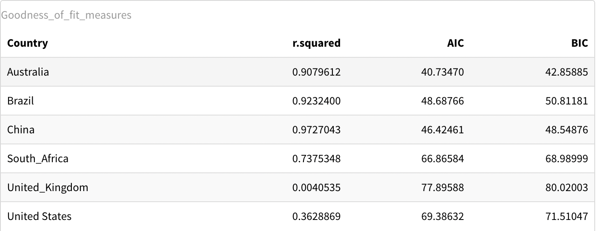
```

This Chinese linear model has a maximum r.squared value around 0.97 and has the smallest AIC and BIC values.
#### .darkgreen[Therefore, the linear model for China is relatively the best.]

---
class: left, top

# Analysis Part2

## Research Question1

- How much FAO i.e. Fats Animal Oil is in Vegetable Oil in Australia that is consumed by people in different year?

```{r out.width = '50%', echo = FALSE, fig.align="center"}
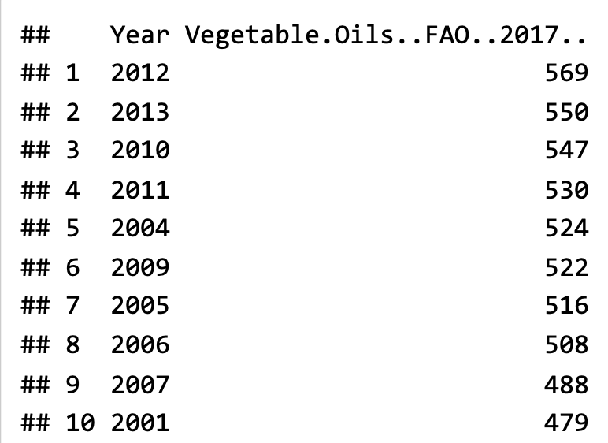
```

#### .darkgreen[Fat oil in vegetable oil is increasing in Australia, due to which people are purchasing less of vegetable oil.] 


---
class: left, top


## Research Question2

- Checking FAO's individual figures for maize, rice and wheat over the years.

```{r out.width = '75%', echo = FALSE, fig.align="center"}
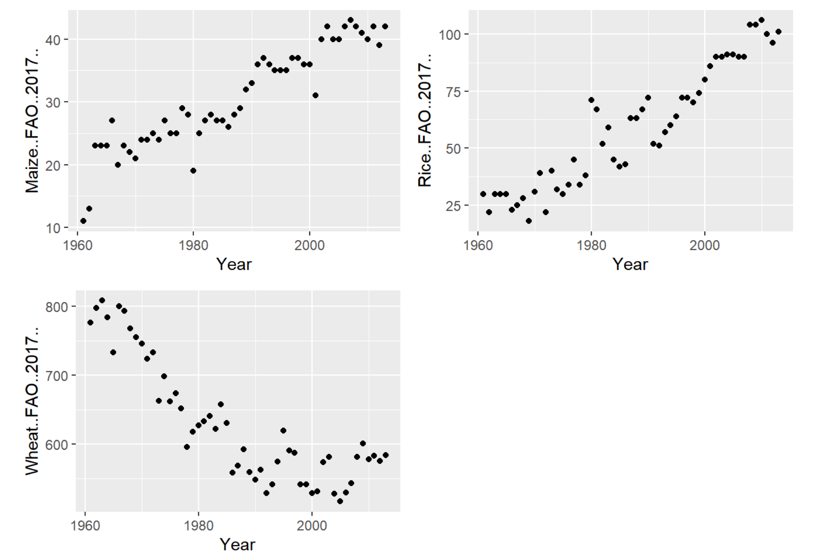
```

#### .darkgreen[Maize, Rice and Vegetable FAO is higher in later years but the wheat growth becomes less in later years in Australia.]


---

class: left, top

# Analysis Part3

## Research Question1

- What is the difference in the proportions of total Calories and the three major nutrients (protein, fat, carbohydrate) from 1970 in the American and Japanese diets?

```{r out.width = '80%', echo = FALSE, fig.align="center"}
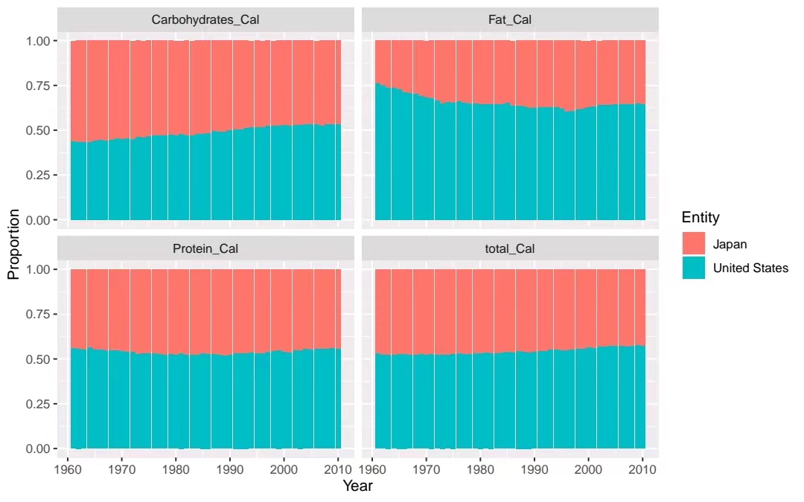
```

---

class: left, top

## Research Question1


```{r out.width = '80%', echo = FALSE, fig.align="center"}
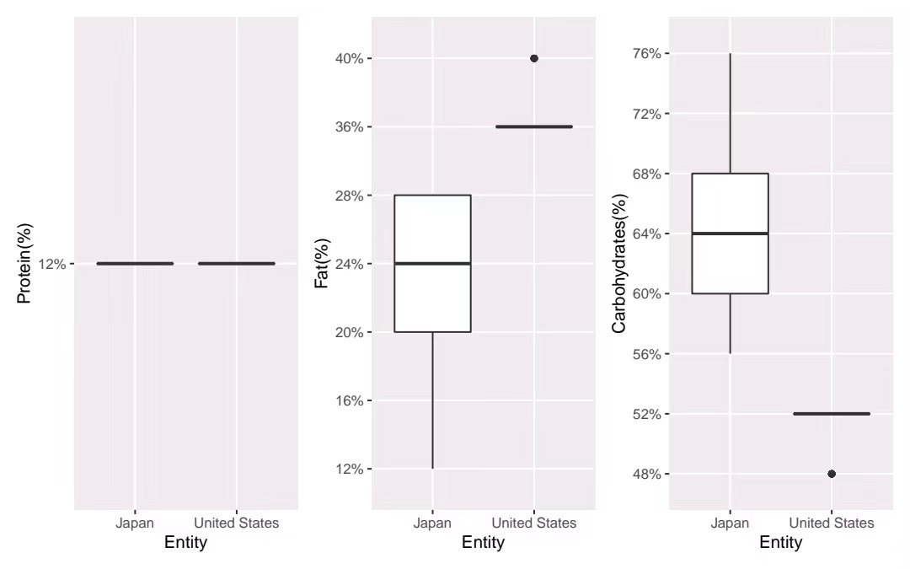
```


#### .darkgreen[figure4 and figure5 show the change in the proportion of calorie, protein, fat and carbohydrate intake in the US and Japan from 1961 to 2010.]

---
class: left, top

## Research Question2

- What is the difference between the time trends of TotalCalories and Calories of Protein, Fat, Carbohydrates in the two countries?

- .green[ Calories Intake of over the years]

```{r out.width = '90%', echo = FALSE, fig.align="center"}
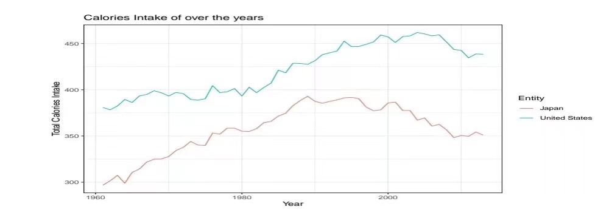
```

#### .darkgreen[The figure6 shows the trend of total calories intake in the United States and Japan over time.]

---
class: left, top

## Research Question2


- .green[ Fat Calories Intake of over the years]

```{r out.width = '100%', echo = FALSE, fig.align="center"}
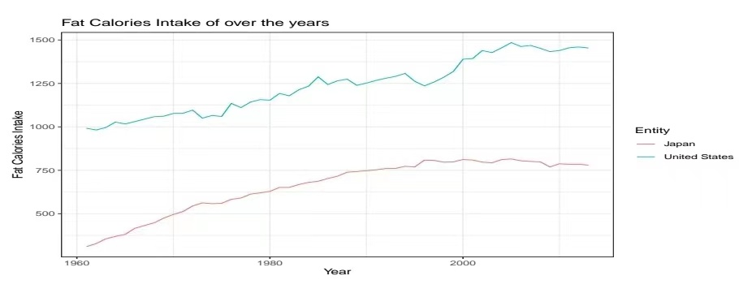
```

#### .darkgreen[The figure7 shows the trend of fat calories intake in the United States and Japan over time.]


---
class:  left, top

## Research Question2

- .green[ Calories Intake of United States]

```{r out.width = '100%', echo = FALSE, fig.align="center"}
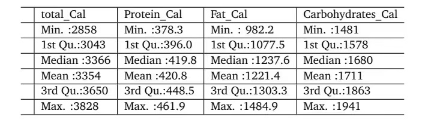
```

#### .darkgreen[It can be seen from above table, that the mean Calories of United States is 3354 kcal.]


---
class:  left, top

## Research Question2

- .green[ Calories Intake of Japan]

```{r out.width = '100%', echo = FALSE, fig.align="center"}
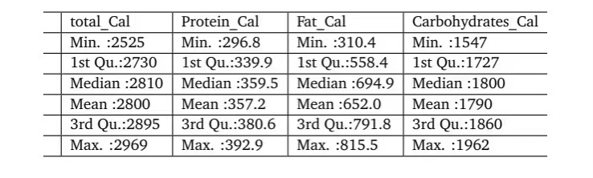
```

#### .darkgreen[It can be seen from above table, that the mean Calories of Japan is 2800 kcal.]


---
class:  left, top

# Analysis Part4

## Research Question

- Rice consumption vs. latitude and region, 2015.

.pull-left[
```{r out.width = '88%', echo = FALSE, fig.align="center"}
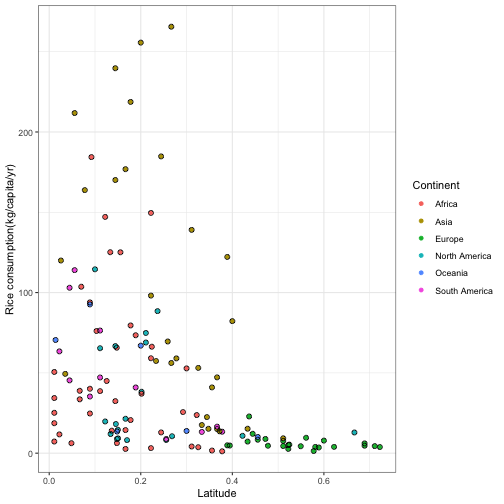
```
]

.pull-right[
##### .darkgreen[It is easy to notice the phenomenon that the countries with higher Annual per capita consumption of rice are mainly in the Latitude between0 and 0.4.]
]

---
class:  left, top


## Research Question


```{r out.width = '80%', echo = FALSE, fig.align="center"}
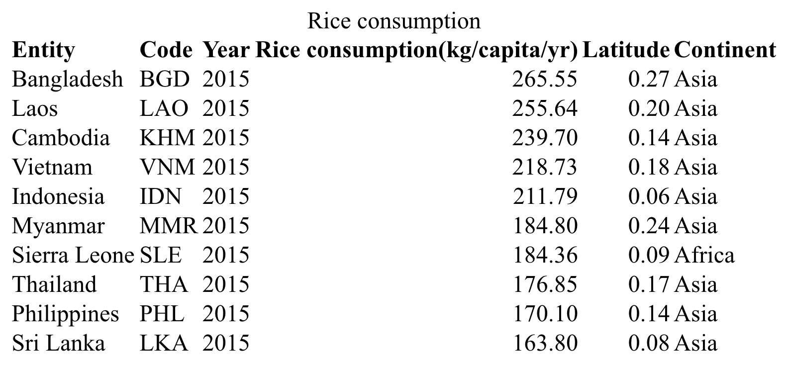
```

#### .darkgreen[According to above table, the top 5 countries with the largest rice consumption are Bangladesh, Laos, Cambodia, Vietnam.]

---
class:  left, top


## Conclusion


* In terms of overall trends, Maize and Rice FAO, as well as the intake of animal protein, are gradually increasing around the world; while countries in Africa and Asia, especially those with a Latitude between 0 and 0.4, have higher rice consumption. 


* For Australia, Vegetable FAO is gradually increasing, while the composition of the Australian diet fluctuates, but most of the changes are not significant, except for Starchy Roots, which shows a certain increase, and Pulses and sugar, which show the opposite trend.


* As well as China, the linear model of the relationship between overweight or obesity and caloric availability since 2000 is relatively the best.

---

```{r endslide, child="EndSlide/endslide.Rmd"}
```  

